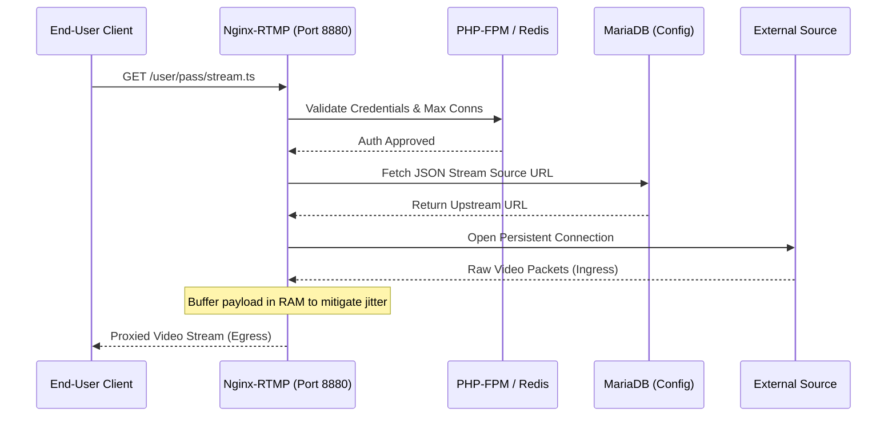
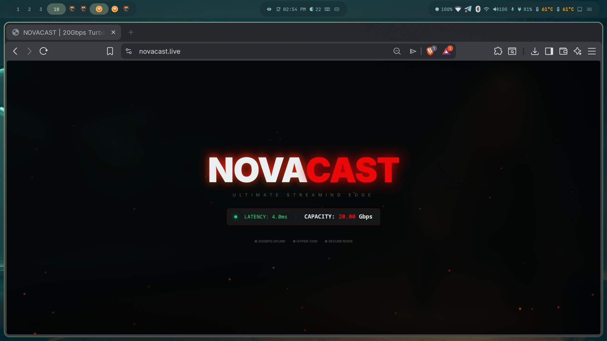
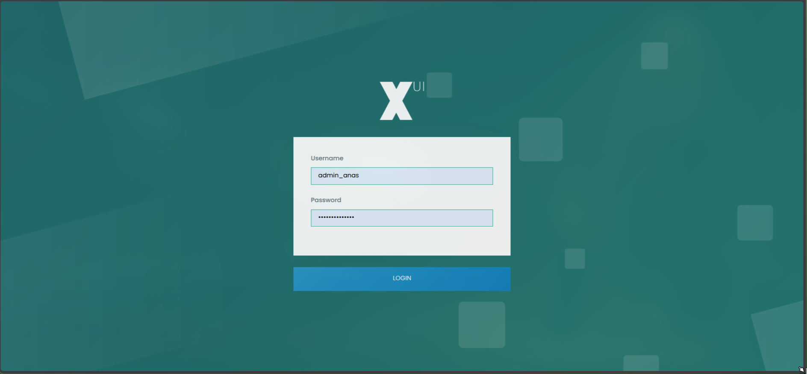
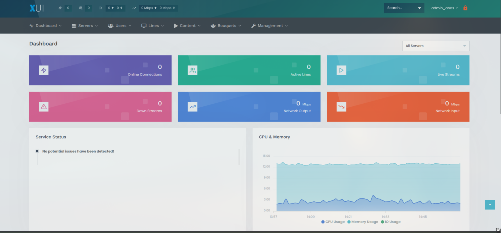
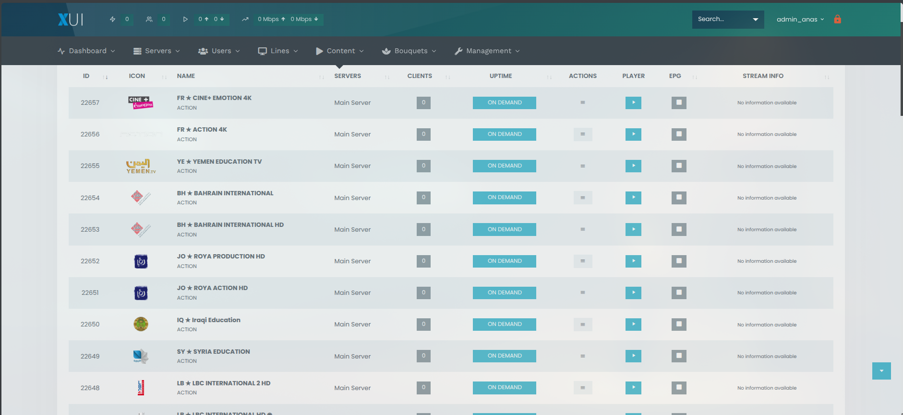
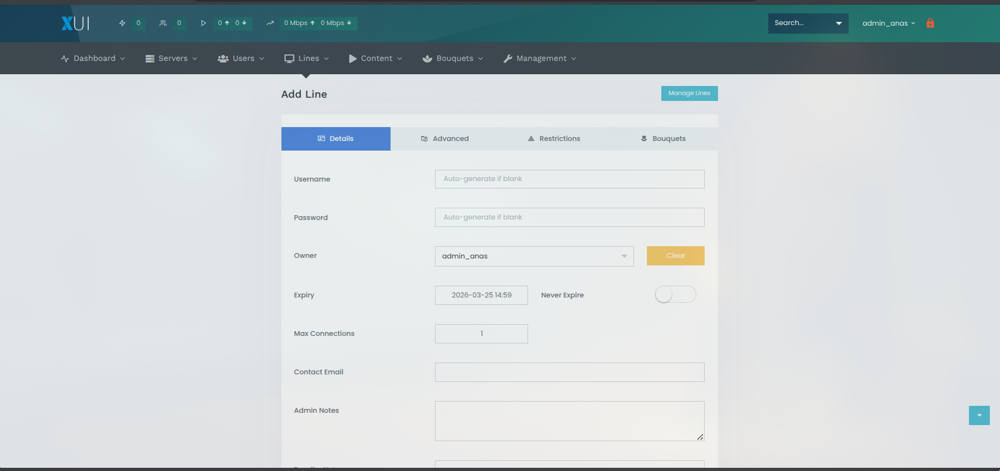
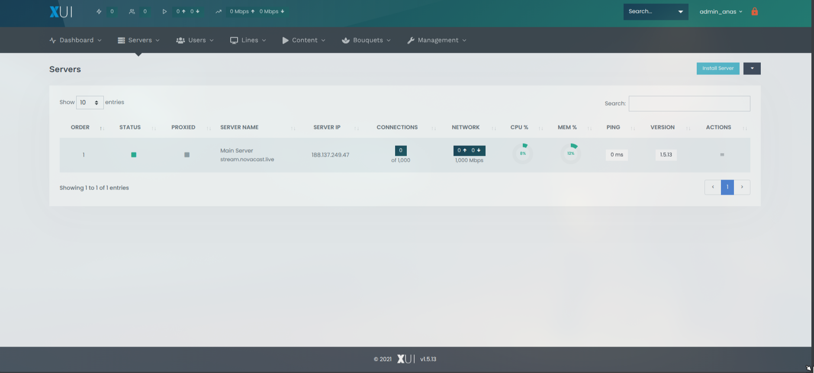
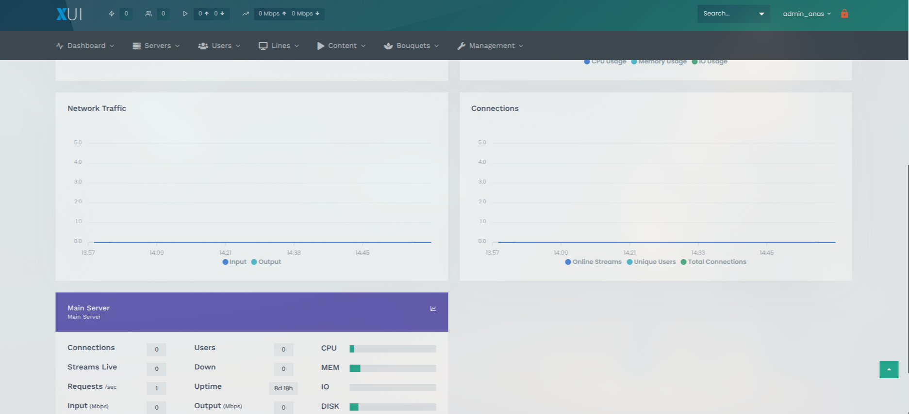

# XUI.one IPTV Infrastructure & DevOps Lab

## Project Overview

This repository documents the deployment, architectural configuration,
and security hardening of a high-concurrency IPTV management system.
Operating as a lab environment, this infrastructure is designed to test
multi-protocol streaming, automated load balancing, and real-time
subscriber management under a decoupled service model.

------------------------------------------------------------------------

## 1. Installation Source and Deployment

The core system was deployed utilizing an automated installation script
from the `amidevous/xui.one` repository. This build implements the
XUI.one management panel alongside its required dependencies, optimized
for Ubuntu/RHEL-based distributions.

### Deployment Command Executed:

``` bash
sudo wget https://raw.githubusercontent.com/amidevous/xui.one/master/install.sh -O /root/install.sh && sudo bash /root/install.sh
```

Note: This specific build includes modifications/cracks tailored for
specific OS versions.

------------------------------------------------------------------------

## 2. System Architecture

The environment utilizes a multi-tier delivery model to separate the web
interface from the streaming engine and data persistence layer, ensuring
high availability.

-   **Edge Gateway (Nginx-RTMP):** A specialized Nginx build optimized
    for real-time media distribution and low-latency stream egress.

-   **Application Logic (PHP 7.4-FPM):** Executes the core backend
    logic, API requests, and background CLI workers.

-   **State Management (Redis):** An in-memory data store for high-speed
    session caching and stream metadata.

-   **Persistence Layer (MariaDB 10.11):** The relational database
    acting as the "Source of Truth" for subscriber credentials and
    stream source URLs (stored as JSON arrays for redundancy).

------------------------------------------------------------------------

## 3. Infrastructure Specifications

-   **Compute:** Intel Xeon Processor (Cascadelake Architecture) --- 6
    Sockets @ 2.0GHz

-   **Memory:** 14GB Physical RAM (High capacity to prevent buffer
    underruns during peak concurrent streaming)

-   **Storage:** 127GB Enterprise SSD (Low I/O wait times optimized for
    database transactions and fast M3U generation)

------------------------------------------------------------------------

## 4. Network and Security Hardening

A strict ingress filtering policy (via UFW/iptables) is enforced to
minimize the attack surface, isolating sensitive backend services from
the public internet.

  -------------------------------------------------------------------------------
  Service      Port     Protocol   Policy       Description
  ------------ -------- ---------- ------------ ---------------------------------
  HTTP/HTTPS   80/443   TCP        Public       Web Dashboard and Client API

  Streaming    8880     TCP        Public       Live Stream Delivery (M3U8/TS)

  Load         31210    TCP        Public       Internal Backend Communication
  Balancer                                      

  SSH          22       TCP        Restricted   Secure Remote Administration

  MariaDB      3306     TCP        Blocked      Isolated to Localhost (127.0.0.1)

  Redis        6379     TCP        Blocked      Isolated to Localhost (127.0.0.1)
  -------------------------------------------------------------------------------

### Background Orchestration

The system relies on dedicated systemd-managed PHP workers running under
the xui user context (preventing root filesystem exposure):

-   **watchdog.php:** Monitors stream health and auto-restarts failed
    RTMP processes.

-   **signals.php:** Processes real-time commands from the admin
    interface.

-   **queue.php:** Handles asynchronous tasks like bulk user updates.

------------------------------------------------------------------------

## 5. Domain Challenges and Operational Risks

Operating an IPTV infrastructure introduces significant technical and
industry-specific challenges.

### Technical Constraints

-   **Upstream Dependency:** High reliance on third-party source
    providers (e.g., external .xyz domains). Upstream downtime directly
    impacts local stream availability.

-   **Transcoding Overhead:** Real-time stream transcoding (via FFmpeg)
    is highly CPU-intensive. Lacking hardware acceleration
    (GPU/QuickSync), high-concurrency FHD streams risk thread
    exhaustion.

-   **Network Jitter:** Delivering stable bitrates across diverse ISP
    routes requires aggressive buffer tuning.

### Security & Industry Risks

-   **DDoS Vulnerability:** Public streaming ports (8880) are highly
    susceptible to volumetric Distributed Denial of Service attacks.

-   **Credential Stuffing:** Automated brute-force attacks targeting
    user accounts.

-   **Compliance & Integrity:** Utilizing cracked installation scripts
    introduces severe risks of embedded backdoors, botnet integration,
    and significant legal liability regarding copyright enforcement.

------------------------------------------------------------------------

## 6. Real-Time Observability and Diagnostics

To monitor system health, database connections, and process states, the
following commands are utilized.

### Network & Socket Mapping

``` bash
# View active listening ports and established streaming connections
ss -tulpn
netstat -anp | grep :8880 | grep ESTABLISHED | wc -l
```

### Database Thread Monitoring

``` bash
# Monitor MariaDB process list for active backend queries
mysqladmin -u root -p proc
```

### Live Log Tailing

``` bash
# Track real-time worker logs and service heartbeats
journalctl -u xuione.service -f
```
# Hardware Allocation & Network Configuration

## Hardware Allocation

### Compute

Intel Xeon Processor (Cascadelake Architecture) --- 6 Sockets @ 2.0GHz

### Memory

14GB Physical RAM (Provisioned to prevent buffer underruns during peak
concurrent streaming)

### Storage

127GB Enterprise SSD (Low I/O wait times, optimized for database
transactions and rapid M3U generation)

### Operating System

RHEL-based Linux (Prime Intel NL-3 v.2)

------------------------------------------------------------------------

## Network Capabilities

### Port Speed

1 Gbps (1000 Mbps) uplink, ensuring sufficient bandwidth to prevent
bottlenecking during high-concurrency stream distribution.

### Bandwidth Allowance

Unmetered traffic. This is a critical architectural requirement for
operating video-on-demand (VOD) and continuous live IPTV services
without encountering ISP data caps or throttling.

------------------------------------------------------------------------

## Vendor-Specific Network Mitigation (IPv6)

During initial deployment, a routing instability was identified within
the IPv6 stack. Dual-stack networking introduced erratic socket binding
behavior for Nginx-RTMP streams and caused delayed upstream source
fetching.

### Resolution

IPv6 was explicitly disabled at the kernel level to enforce exclusive
IPv4 traffic routing, stabilizing stream handshakes and packet delivery.

``` bash
# Applied IPv6 Kernel Mitigation
sudo sysctl -w net.ipv6.conf.all.disable_ipv6=1
sudo sysctl -w net.ipv6.conf.default.disable_ipv6=1
sudo sysctl -w net.ipv6.conf.lo.disable_ipv6=1
sudo sysctl -p
```
# Restreaming Architecture & Traffic Flow

## Overview

This IPTV lab functions as a highly efficient reverse proxy for media
streams, known as "Restreaming". It bridges external upstream providers
and end-users, managing authentication, buffering, and obfuscation of
the original source.

------------------------------------------------------------------------

## 7.1 Restreaming Lifecycle

The stream delivery process follows a strict, three-phase lifecycle
executed by decoupled services.

### Phase 1: Client Ingress & Authentication

1.  **Request:** End-user client (e.g., Smart IPTV, VLC) sends an HTTP
    GET request to the Nginx Edge gateway on port `8880` with
    credentials and channel ID (e.g.,
    `/username/password/channel_id.ts`).
2.  **Validation:** Nginx forwards authentication parameters to PHP-FPM
    backend.
3.  **State Check:** PHP queries Redis cache to verify account status
    and concurrency limits. If valid, an internal token is generated.

### Phase 2: Upstream Ingestion (Source Fetching)

1.  **Source Lookup:** System queries MariaDB `streams` table to find
    associated `stream_source` (JSON array with primary/backup URLs).
2.  **Ingestion:** Nginx-RTMP/FFmpeg connects to upstream provider
    (external `.xyz` source).
3.  **Buffering:** Incoming MPEG-TS packets are stored in RAM (14GB) to
    absorb upstream network jitter.

### Phase 3: Egress & Delivery

1.  **Proxying:** Buffered stream is repackaged and sent to end-user
    over port `8880`.
2.  **Source Obfuscation:** End-user communicates only with VPS IP.
    Original upstream DNS/IP remains hidden.

------------------------------------------------------------------------

## 7.2 Sequence Diagram of Stream Delivery



------------------------------------------------------------------------

## 7.3 Directory & Service Tree Representation

    XUI.one-IPTV-Lab/
    ├─ nginx-rtmp/                  # Edge Gateway for streaming
    │  ├─ conf.d/
    │  │  └─ default.conf           # RTMP & HTTP config
    │  └─ logs/
    ├─ php-fpm/                     # Application logic
    │  ├─ www.conf                  # Pool config
    │  └─ workers/
    │     ├─ watchdog.php           # Stream health monitoring
    │     ├─ signals.php            # Real-time admin commands
    │     └─ queue.php              # Async task processing
    ├─ redis/                       # Session & stream metadata caching
    ├─ mariadb/                      # Persistence layer
    │  └─ streams/                  # Stream source storage (JSON)
    ├─ ffmpeg/                       # Transcoding engine (optional)
    └─ scripts/
       └─ install.sh                # Automated deployment script

This tree diagram represents all the major services and their roles
within the restreaming architecture.
### 7.3 DNS Routing & Edge Delivery (Cloudflare Bypass Strategy)
To ensure uninterrupted media delivery and mitigate third-party proxy interference, a **Split-DNS architecture** is employed. 


* **Management Interface (Protected):** The main domain used for the web dashboard and API remains protected behind a standard Web Application Firewall (WAF) to prevent credential stuffing and Layer 7 DDoS attacks.
* **Streaming Edge Domain (`stream.novacast.live`):** A dedicated egress domain specifically configured to bypass Cloudflare's HTTP proxy (Set to "DNS-Only" mode). 

**The DevOps Rationale:** Routing continuous, long-lived video streams (MPEG-TS/HLS) through standard Cloudflare proxy tiers frequently results in aggressive connection termination, buffering, and packet inspection delays. By routing the delivery traffic directly through `stream.novacast.live` to the Zomro VPS, the system achieves:
1. **Zero-Interference Routing:** Bypassing Cloudflare's deep packet inspection allows the 1Gbps unmetered uplink to operate at maximum efficiency.
2. **Reduced Latency:** Direct client-to-server TCP handshakes eliminate the external proxy hop, which is critical for real-time live sports events.
3. **Connection Stability:** Prevents forced timeouts on long-lived HTTP GET requests, which are typical of continuous IPTV client sessions.

##8

## 📸 System Showcase & Visual Architecture

### 1. Edge Delivery & Client Portal
The custom-branded client egress portal routed through a Split-DNS architecture to bypass standard WAF proxy limitations.


### 2. Authentication & Management Dashboard
The secure backend interface providing real-time observability over system resources, including CPU idle states and memory buffer capacity.



### 3. Upstream Ingestion & Content Management
The stream management layer responsible for fetching, validating, and proxying external media sources via the Nginx-RTMP engine.


### 4. Subscriber Provisioning
Access control interface where client tokens and M3U playlists are generated and injected into the MariaDB/Redis state layer.


### 5. Infrastructure Observability & Traffic Flow
Real-time monitoring of internal PHP workers and the 1Gbps unmetered ingress/egress network throughput.


## Acknowledgements

Special thanks to all developers and Amine Areche for their support.

We also appreciate the maintainers of the underlying tools and libraries, including Nginx-RTMP, FFmpeg, Redis, MariaDB, and PHP-FPM.
